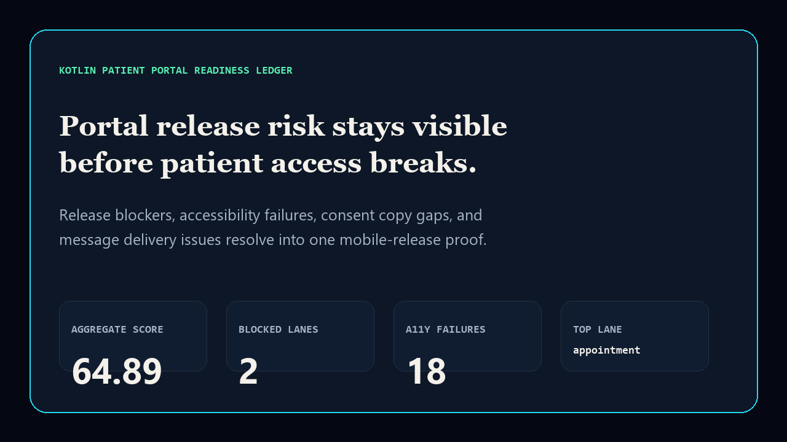
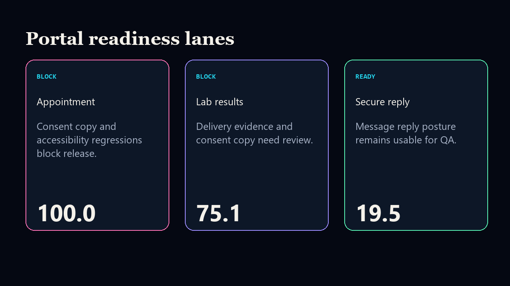

# kotlin-patient-portal-readiness-ledger

[](https://github.com/mizcausevic-dev/kotlin-patient-portal-readiness-ledger/actions/workflows/ci.yml)
[](https://github.com/mizcausevic-dev/kotlin-patient-portal-readiness-ledger/actions/workflows/pages.yml)
[](LICENSE)

Kotlin Patient Portal Readiness Ledger turns mobile release blockers, accessibility failures, consent copy gaps, message delivery failures, and crash-free posture into one board-readable release proof.

## Why this exists

- Patient portal risk gets expensive when release blockers, accessibility, consent language, and messaging reliability are reviewed separately.
- Kotlin is a direct signal for mobile and Android patient portal work.
- This repo gives practical HealthTech / patient access / Kotlin proof without exposing PHI or production portal data.

## Screenshots





## Local run

```bash
python -m pip install -e .
python -m unittest discover -s tests
python scripts/run_demo.py
python scripts/check_sql.py
python scripts/check_kotlin_contract.py
python scripts/prerender.py
python scripts/smoke_check.py
```

## Board question answered

> Which patient portal release lanes threaten access, consent, accessibility, and trust before the next mobile launch?

